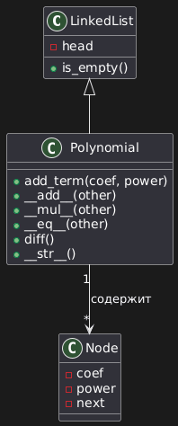

## Подпункт 4.1. Внутренние (вложенные) классы

### Теоретическое описание

Внутренний (вложенный) класс - это класс, объявленный внутри другого класса. Он используется для описания сущностей, которые логически принадлежат внешнему классу и не имеют смысла вне его контекста.

Пример объявления вложенного класса в Python:

```python
class Outer:
    class Inner:
        pass
```

Класс `Inner` существует только в контексте класса `Outer` и используется через него

### Назначение вложенных классов

Вложенные классы применяются:

- для логического объединения связанных сущностей;
- для повышения читаемости архитектуры программы;
- для ограничения области видимости вспомогательных классов;
- для инкапсуляции деталей реализации.

### Связь с выполненным заданием

В рамках данного задания одночлен полинома логически является частью полинома и может рассматриваться как вложенный класс. Узел односвязного списка представляет одночлен и используется только в контексте полинома.

В реализации узел вынесен в отдельный модуль для наглядности архитектуры, однако по смыслу он соответствует концепции вложенного класса.

---

## Подпункт 4.2. Проектирование класса «Полином» на основе односвязного списка

### Теоретическая основа

Полином - это математическое выражение вида:

```
aₙxⁿ + aₙ₋₁xⁿ⁻¹ + ... + a₁x + a₀
```

Каждое слагаемое называется одночленом и характеризуется коэффициентом и степенью.

### Выбор структуры данных

Для хранения полинома был выбран односвязный список. Каждый узел списка хранит один одночлен полинома:

- коэффициент;
- степень;
- ссылку на следующий узел.

Список хранится отсортированным по убыванию степеней.

### Хранение полинома в памяти

Пример полинома:

```
5x² + 3x + 7
```

Представление в памяти:

```
head
 ↓
[5x²] -> [3x¹] -> [7x⁰] -> None
```

### Диаграмма классов (текстовое представление)

```

```

---

## Подпункт 4.3. Реализация операций и демонстрационная программа

### Реализованные операции

В классе `Polynomial` были реализованы следующие операции:

- сложение полиномов (перегрузка оператора `+`);
- умножение полиномов (перегрузка оператора `*`);
- сравнение полиномов (перегрузка оператора `==`);
- дифференцирование полинома.

### Описание алгоритмов

**Сложение:**

Происходит одновременный проход по двум односвязным спискам с учётом степеней одночленов.

**Умножение:**

Каждый одночлен первого полинома умножается на каждый одночлен второго полинома, после чего результат аккумулируется.

**Сравнение:**

Полиномы сравниваются поэлементно. Они равны, если совпадают все коэффициенты и степени.

**Дифференцирование:**

Используется правило:

```
a·xⁿ → a·n·xⁿ⁻¹
```

Одночлены со степенью 0 не попадают в результат.

### Демонстрация работы

В файле `main.py`:

- создаются два случайных полинома;
- выполняются все операции;
- результаты выводятся на экран.

Это подтверждает корректность реализации всех методов.

---

## Подпункт 4.4. Паттерн программирования «Прототип»

### Теоретическое описание

Паттерн проектирования «Прототип» используется для создания копий объектов без необходимости повторного создания и настройки их состояния. Основная идея паттерна заключается в том, что объект самостоятельно умеет создавать свою копию.

Такой подход позволяет:

- быстро клонировать сложные объекты;
- сохранять внутреннее состояние объекта;
- работать с объектами полиморфно, не зная их точный тип;
- упростить архитектуру программы.

### Прототип в Python

В Python для копирования объектов используется модуль `copy`, содержащий функции `copy()` и `deepcopy()`. Глубокое копирование (`deepcopy`) создаёт полностью независимую копию объекта, включая все вложенные структуры данных.

### Пример реализации паттерна «Прототип»

```python
from copy import deepcopy

class Shape:
    def __init__(self, x=0, y=0, color="black"):
        self.x = x
        self.y = y
        self.color = color

    def clone(self):
        """
        Базовый метод клонирования через deepcopy
        Deepcopy делает глубокую копию, включая все вложенные объекты
        Просто copy создаст новый объект, но вложенный объект он не скопирует, а просто перенесётся по ссылке
        """
        return deepcopy(self)


class Rectangle(Shape):
    def __init__(self, x=0, y=0, color="black", width=0, height=0):
        super().__init__(x, y, color)
        self.width = width
        self.height = height


class Circle(Shape):
    def __init__(self, x=0, y=0, color="black", radius=0):
        super().__init__(x, y, color)
        self.radius = radius


circle1 = Circle(10, 20, "red", radius=15)
circle2 = circle1.clone()

print(circle1.radius, circle2.radius) #радиус и там, и там будет равен 15, чисто потому что это чистый клон объекта
print(circle1 is circle2) #но данные, которые один и другой круг будет занимать в памяти компьютера - разный, отсюда и не совпадение двух объектов. Хотя казалось, один копирует другого
```

### Пояснение к примеру

В результате вызова метода `clone()` создаётся новый объект с теми же значениями атрибутов, но занимающий другую область памяти. Это подтверждается тем, что проверка `circle1 is circle2` возвращает `False`.

---

## Итоговый вывод

В ходе выполнения задания 4 были изучены и реализованы:

- вложенные классы;
- односвязные списки;
- объектно-ориентированное программирование;
- перегрузка операторов;
- паттерн проектирования «Прототип».

Все подпункты задания выполнены и продемонстрированы как на уровне теории, так и на уровне практической реализации.

